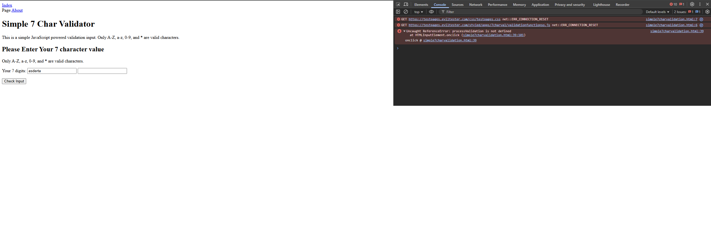

# Eviltester - Character Validation Test Automation

This is a sample automation project built with **Selenium WebDriver**, **TestNG**, **Page Object Pattern**, and **Lombok**.

## Test Page
The tests cover input validation on the following web form:  
https://testpages.eviltester.com/styled/apps/7charval/simple7charvalidation.html

## Tech Stack
- Java 17+
- Selenium WebDriver
- TestNG
- Page Factory
- Lombok
- WebDriverManager

## Project Structure
src/
├── main/
│ └── java/
│ └── pages/ # Page Object for validation form
├── test/
│ └── java/
│ ├── base/ # Base test class with setup/teardown
│ └── tests/ # TestNG tests

## How to Run Tests

1. Clone this repo:
   
git clone https://github.com/Yulia-QC/eviltester
cd eviltester

2. Run tests using Maven:

mvn clean test

## Sample Tests
The tests include:
Valid input (exactly 7 characters)
Too short input
Too long input
Empty input

## Note
Please note that the test page is currently not functioning due to a missing validation script.
I’ve documented the issue and added the test scenarios based on expected behavior using test design techniques such as boundary value analysis.

## Test Page

The tests cover input validation on the following web form:  
👉 https://testpages.eviltester.com/styled/apps/7charval/simple7charvalidation.html

  

Let me know if you'd prefer me to demonstrate it locally or use a different URL.

Best regards,
Yuliia
